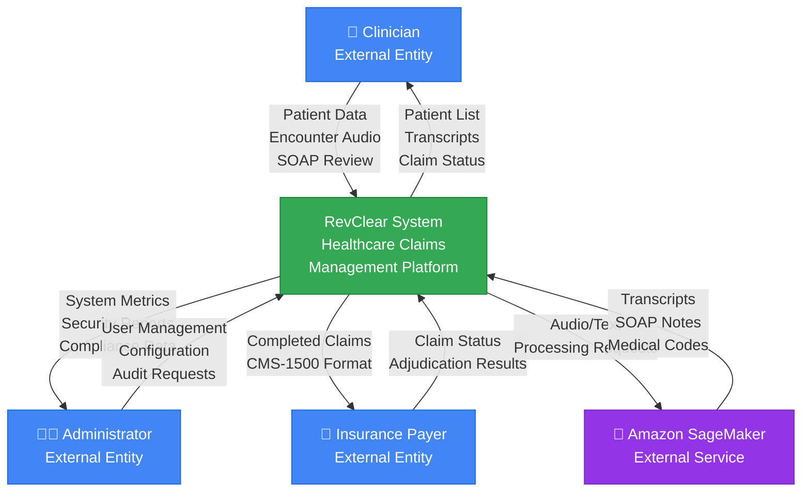
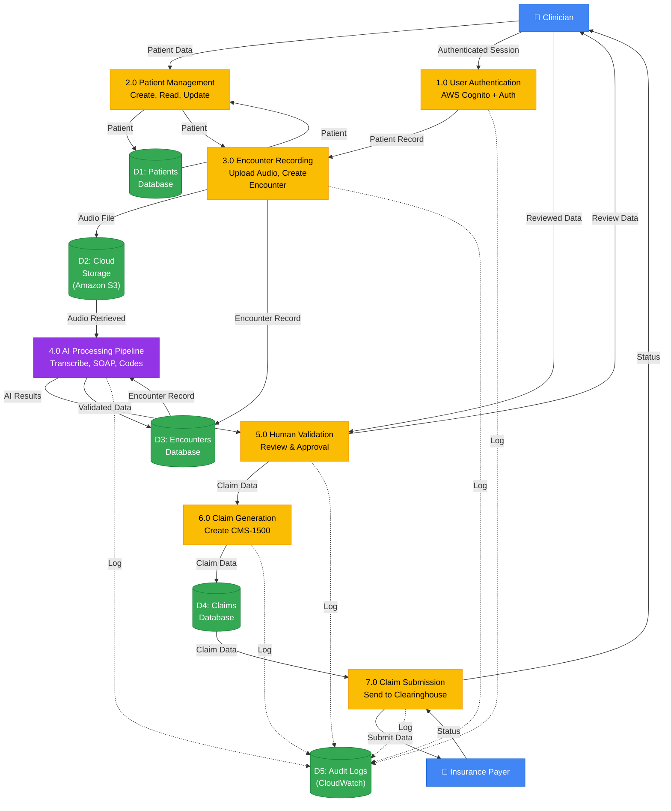
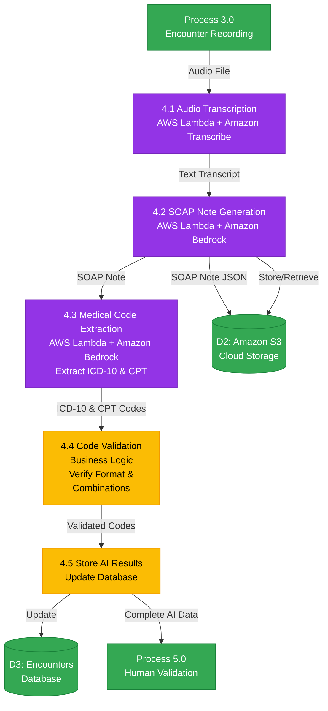

# RevClear System Architecture Diagrams

## 1. Context Diagram (Level 0)

### External Entities

**Clinician (External Entity)**
- Provides patient encounter data and audio recordings
- Reviews and approves AI-generated transcripts and SOAP notes
- Monitors claim status and patient lists

**Administrator (External Entity)**
- Manages system users and configurations
- Reviews security reports and compliance data
- Performs audit requests and system monitoring

**Insurance Payer (External Entity)**
- Receives completed claims in CMS-1500 format
- Provides claim adjudication results and status updates

**Amazon SageMaker (External Service)**
- Processes audio and text data
- Generates transcripts, SOAP notes, and medical codes

---

## 2. Data Flow Diagram - Level 1 (System Overview)

### Process Descriptions

**1.0 User Authentication**
- AWS Cognito authentication with MFA
- Session management and token generation
- Role-based access control

**2.0 Patient Management**
- CRUD operations for patient records
- HIPAA-compliant data storage
- Patient search and filtering

**3.0 Encounter Recording**
- Audio file upload to Amazon S3
- Encounter metadata creation
- Session documentation

**4.0 AI Processing Pipeline**
- Audio transcription via Amazon Transcribe
- SOAP note generation via Amazon Bedrock
- Medical code extraction (ICD-10, CPT)

**5.0 Human Validation**
- Clinician review of AI results
- Approval workflow (3 HITL gates)
- Manual corrections and edits

**6.0 Claim Generation**
- CMS-1500 form creation
- FHIR resource generation via AWS HealthLake
- EDI 837 formatting

**7.0 Claim Submission**
- Submission to external clearinghouse
- Status tracking and monitoring
- 997/999 acknowledgment processing

---

## 3. Data Flow Diagram - Level 2 (AI Processing Pipeline)

### AI Processing Pipeline Details

**4.1 Audio Transcription**
- **Service**: AWS Lambda + Amazon Transcribe
- **Input**: Audio file from Amazon S3
- **Output**: Text transcript with timestamps
- **Features**: Medical vocabulary, speaker identification, confidence scores

**4.2 SOAP Note Generation**
- **Service**: AWS Lambda + Amazon Bedrock (Claude/Titan)
- **Input**: Text transcript
- **Output**: Structured SOAP note (Subjective, Objective, Assessment, Plan)
- **Storage**: JSON stored in Amazon S3 for retrieval

**4.3 Medical Code Extraction**
- **Service**: AWS Lambda + Amazon Bedrock
- **Input**: SOAP note JSON
- **Output**: ICD-10 diagnosis codes and CPT procedure codes
- **Features**: Multi-code extraction, confidence scoring, code descriptions

**4.4 Code Validation**
- **Service**: Business logic validation
- **Input**: ICD-10 & CPT codes
- **Output**: Validated codes
- **Validation**: Format checking, code compatibility, insurance requirements

**4.5 Store AI Results**
- **Service**: Database update operation
- **Input**: All AI-generated data
- **Output**: Updated encounter record
- **Action**: Prepare for human validation (Process 5.0)

---

## Technology Stack (AWS Services)

### Core Services
- **Amazon Transcribe**: Medical speech-to-text conversion
- **Amazon Bedrock**: AI/ML for SOAP notes and code extraction
- **AWS Lambda**: Serverless compute for processing functions
- **Amazon SageMaker**: Custom ML models (alternative to Bedrock)
- **Amazon S3**: Object storage for audio and documents
- **Amazon RDS PostgreSQL**: Relational database for structured data
- **AWS Cognito**: User authentication and authorization
- **AWS HealthLake**: FHIR-compliant healthcare data storage

### Security & Compliance
- **AWS KMS**: Encryption key management
- **AWS CloudTrail**: Audit logging
- **Amazon CloudWatch**: Monitoring and alerting
- **AWS WAF & Shield**: DDoS protection and firewall
- **Amazon VPC**: Network isolation

### Integration & Analytics
- **Amazon SNS/SQS**: Event-driven messaging
- **Amazon Redshift**: Analytics data warehouse
- **AWS Step Functions**: Workflow orchestration

---

## Data Flow Summary

1. **Clinician Input** → System receives patient data and encounter audio
2. **AI Processing** → Amazon Transcribe + Bedrock generate clinical documentation
3. **Human Validation** → Three HITL gates ensure accuracy
4. **Claim Generation** → AWS HealthLake creates FHIR resources and EDI 837
5. **Submission** → External clearinghouse receives claim
6. **Monitoring** → CloudWatch logs and CloudTrail audit all activities

---

## Compliance & Security Features

- **HIPAA Compliant**: All AWS services under BAA
- **Encryption**: At-rest (KMS) and in-transit (TLS 1.3)
- **Audit Trail**: Complete logging via CloudTrail
- **Access Control**: IAM roles with least privilege
- **Network Security**: VPC isolation, private subnets
- **Data Retention**: 7-year compliance retention

---

Last Updated: November 8, 2025
