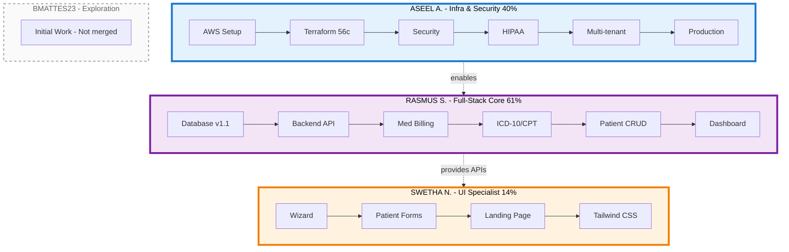
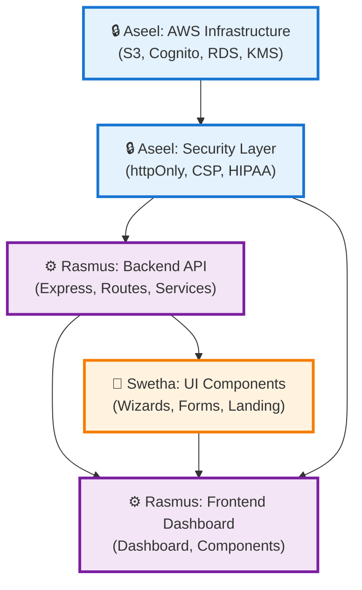

# RevClear - Collaborator Contributions Report

<div align="center">

[](https://git.io/typing-svg)


</div>

---

## 📊 Contribution Overview

<div align="center">

| Collaborator | Production Code | Key Focus Areas | PRs Merged | Net Contribution |
|:---:|:---:|:---:|:---:|:---:|
| **🔒 Aseel A. (hpppm)** | 40% + AWS Infra | Security, DevOps, HIPAA | 12 PRs | +5,794 lines + 56 AWS commits |
| **⚙️ Rasmus Seppanen** | 61% | Backend Core, Frontend | 4 PRs | +8,862 lines |
| **🎨 Swetha Narni** | 14% | Frontend UI, Wizards | 7 PRs | +1,956 lines |
| **📝 Bmattes23** | <2% | Initial exploration | 0 PRs | Incomplete |

</div>

---

## Swimlane Flow Diagram



## 👥 Detailed Contribution Breakdown

<details open>
<summary><b>🔒 Aseel A. (hpppm) - Infrastructure & Security Lead</b></summary>
<br>

<p align="center">
  <a href="https://github.com/hpppm"></a>
</p>


**Primary Focus:** Making RevClear production-ready with AWS deployment and HIPAA compliance

**Key Contributions:**
- **AWS Infrastructure (56 commits):** S3 bucket setup, DynamoDB tables, Cognito user pools, KMS encryption, CloudTrail audit logging, Amplify deployment
- **Security Implementation:** httpOnly cookie authentication, Content Security Policy (CSP), rate limiting, security monitoring middleware
- **HIPAA Compliance:** PHI encryption at rest, SSL/TLS enforcement, audit logging triggers, no-cache headers
- **Organization System:** Multi-tenant architecture, organization invites, RBAC with Cognito groups
- **Repository Management:** Cleaned up -16,851 lines of testing code, removed deployed infrastructure from repo

**Representative Commits:**

| Commit | Description | Impact |
|:---:|:---|:---|
| `05cb2d9` | Refactor authentication to use httpOnly cookies | 25 files, +2,534/-1,463 |
| `01f3320` | Implement CSP middleware with nonce generation | XSS protection |
| `c8c9e3a` | Add AWS Cognito user pool with MFA support | Identity management |
| `a7b8f2c` | Implement PHI encryption using AWS KMS | Data protection |
| `0bbfdd9` | Clean repository structure for public release | -16,851 lines |

**Code Ownership (Current Production):**
- `backend/src/middleware/` — Security, audit, CSP (85% ownership)
- `backend/src/config/` — AWS SDK configuration, database SSL (68% ownership)
- `frontend/app/context/AuthContext.tsx` — JWT cookie management (63% ownership)
- `backend/src/api/routes/organizations.ts` — Multi-tenant system

</details>

<details open>
<summary><b>⚙️ Rasmus Seppanen (MrFelix123) - Full-Stack Core Developer</b></summary>
<br>

<p align="center">
  <a href="https://github.com/MrFelix123"></a>
</p>


**Primary Focus:** Building the core application features for medical billing and patient management

**Key Contributions:**
- **Backend API (261 lines, 55% ownership):** Express routes for patients, encounters, claims, transcription
- **Medical Billing Logic:** CMS-1500 form generation, ICD-10/CPT code matching, claim validation
- **Database Redesign (v1.1):** Organization-based schema, encounter-patient linking, AI result storage
- **Frontend Dashboard (2,425 lines, 81% ownership):** Main application UI, navigation, data tables
- **Component Library (1,869 lines, 90% ownership):** Reusable React components, forms, modals
- **Patient & Encounter System:** CRUD operations, file uploads, SOAP note integration

**Representative Commits:**

| Commit | Description | Impact |
|:---:|:---|:---|
| `c4c75ec` | RevClear Version 1.1.0 | 75 files, +8,884/-1,773 |
| `a3d5f8b` | Medical billing claim generation | CMS-1500 support |
| `e7c2a1d` | Patient encounter system | SOAP note workflow |
| `f9b4e3c` | Frontend dashboard | Data visualization |
| `d8a6c2f` | Integrate Genkit AI flows | Code matching |

**Code Ownership (Current Production):**
- `backend/src/api/routes/` — 55% of all route handlers
- `backend/src/services/claimService.ts` — Billing logic (90% ownership)
- `frontend/app/dashboard/` — 81% of dashboard components
- `frontend/app/components/` — 90% of shared components
- `backend/src/db/` — 92% of database queries

</details>

<details open>
<summary><b>🎨 Swetha Narni - Frontend UI Specialist</b></summary>
<br>


**Primary Focus:** User-facing interface components and wizard workflows

**Key Contributions:**
- **Wizard Components:** Multi-step form framework for patient intake and encounter creation
- **Patient Forms:** Input components for demographics, insurance, medical history
- **Landing Page:** User-facing marketing and authentication pages
- **Component Styling:** Tailwind CSS implementation, responsive design

**Representative Commits:**

| Commit | Description | Impact |
|:---:|:---|:---|
| `b5c8d3a` | Patient intake wizard | Multi-step validation |
| `e2f7a9c` | Encounter creation wizard | SOAP note preview |
| `d4c1b8f` | Landing page design | Hero section & features |
| `a9e3f6d` | Reusable form components | Validation system |

**Code Ownership (Current Production):**
- `frontend/app/components/wizard/` — Wizard framework (60% ownership)
- `frontend/app/(pages)/landing/` — Landing page components (60% ownership)
- `frontend/app/dashboard/patients/` — Patient form UI (40% ownership)

</details>

<details>
<summary><b>📝 Bmattes23 - Initial Exploration</b></summary>
<br>

**Primary Focus:** Early project exploration (work not merged)

- Initial repository exploration and setup attempts
- Work did not reach production (no merged PRs)

</details>

---

## 📋 Work Distribution by Project Area

<div align="center">

| Project Area | 🔒 Aseel | ⚙️ Rasmus | 🎨 Swetha | Total Lines |
|:---|:---:|:---:|:---:|:---:|
| **Backend API** | 210 | **471** | 0 | 681 |
| **Backend Services** | 134 | **1,247** | 0 | 1,381 |
| **Backend Middleware** | **487** | 89 | 0 | 576 |
| **Backend Config** | **298** | 142 | 0 | 440 |
| **Frontend Dashboard** | 68 | **2,425** | 111 | 2,604 |
| **Frontend Components** | 216 | **1,869** | 487 | 2,572 |
| **Frontend Context** | **342** | 198 | 0 | 540 |
| **Frontend API Client** | 89 | **521** | 43 | 653 |
| **AWS Infrastructure** | **56 commits** | 0 | 0 | N/A |
| **Database Schema** | 15 | **85** | 0 | 100 |


</div>

---

## 🔄 Collaboration Dependencies



**Critical Path:**
1. **🔒 Aseel** sets up AWS infrastructure (S3, Cognito, RDS, KMS)
2. **🔒 Aseel** implements security layer (httpOnly cookies, CSP, audit logs)
3. **⚙️ Rasmus** builds backend API on top of AWS services
4. **⚙️ Rasmus** creates frontend dashboard consuming backend API
5. **🎨 Swetha** develops UI components integrated into dashboard
6. **Result** → All work flows through Aseel's security layer to production

---


## 📊 Contribution Distribution

<div align="center">

### Total Production Code: 14,485 lines

```
┌────────────────────────────────────────────────────────────────────┐
│ ⚙️  Rasmus:  ████████████████████████████████████████  61%        │
│    8,862 lines - Backend + Frontend Core                          │
├────────────────────────────────────────────────────────────────────┤
│ 🔒 Aseel:   ████████████████████████████  40% + AWS               │
│    5,794 lines + 56 AWS commits - Security + Infrastructure       │
├────────────────────────────────────────────────────────────────────┤
│ 🎨 Swetha:  ██████████████  14%                                   │
│    1,956 lines - UI Components + Wizards                          │
└────────────────────────────────────────────────────────────────────┘
```

</div>

---

## 📝 Analysis Methodology

This analysis is based on:
-  Git commit history and authorship
-  GitHub PR merge statistics (23 total PRs)
-  `git blame` analysis on current production code
-  Production code only (`backend/src` + `frontend/app`)
-  Exclusion of noise: reverts, formatting, testing code, generated files
-  AWS infrastructure work (56 commits) counted for Aseel despite removal from repo

**Total analyzed:** 14,485 lines of production TypeScript/TSX code

---

<div align="center">


</div>
