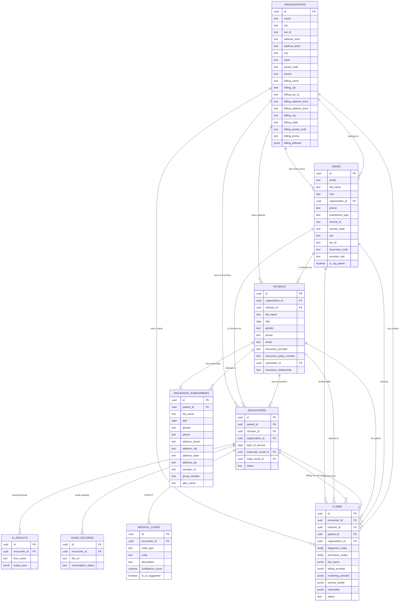

# RevClear ER Diagram (based on `backend/docs/db/revclear_schema_current.sql`)

```mermaid
erDiagram
    ORGANIZATIONS ||--o{ USERS : "has many users"
    ORGANIZATIONS ||--o{ PATIENTS : "owns patients"
    ORGANIZATIONS ||--o{ ENCOUNTERS : "owns encounters"
    ORGANIZATIONS ||--o{ CLAIMS : "owns claims"

    USERS }o--|| ORGANIZATIONS : "belongs to"
    USERS ||--o{ PATIENTS : "is clinician for"
    USERS ||--o{ ENCOUNTERS : "is clinician for"
    USERS ||--o{ CLAIMS : "renders/bills"

    PATIENTS ||--o{ ENCOUNTERS : "has encounters"
    PATIENTS ||--o{ CLAIMS : "claimed in"
    PATIENTS ||--o| INSURANCE_SUBSCRIBERS : "has subscriber"

    ENCOUNTERS ||--o{ AI_RESULTS : "transcript/soap"
    ENCOUNTERS ||--o{ AUDIO_RECORDS : "audio uploads"
    ENCOUNTERS ||--o{ MEDICAL_CODES : "ICD/CPT"
    ENCOUNTERS ||--o{ CLAIMS : "billing for encounter"

    CLAIMS }o--|| ENCOUNTERS : "derived from"
    CLAIMS }o--|| PATIENTS : "for patient"
    CLAIMS }o--|| USERS : "clinician"
    CLAIMS }o--|| ORGANIZATIONS : "org context"

    INSURANCE_SUBSCRIBERS }o--|| PATIENTS : "belongs to"

    ORGANIZATIONS {
      uuid id PK
      text name
      text npi
      text tax_id
      text address_line1
      text address_line2
      text city
      text state
      text postal_code
      text phone
      text billing_name
      text billing_npi
      text billing_tax_id
      text billing_address_line1
      text billing_address_line2
      text billing_city
      text billing_state
      text billing_postal_code
      text billing_phone
      jsonb billing_defaults
    }

    USERS {
      uuid id PK
      text email
      text full_name
      text role
      uuid organization_id FK
      text phone
      text practitioner_type
      text license_id
      text license_state
      text npi
      text tax_id
      text taxonomy_code
      text provider_role
      boolean is_org_admin
    }

    PATIENTS {
      uuid id PK
      uuid organization_id FK
      uuid clinician_id FK
      text full_name
      date dob
      text gender
      text phone
      text email
      text insurance_provider
      text insurance_policy_number
      uuid subscriber_id FK
      text insurance_relationship
    }

    ENCOUNTERS {
      uuid id PK
      uuid patient_id FK
      uuid clinician_id FK
      uuid organization_id FK
      date date_of_service
      uuid transcript_result_id FK
      uuid soap_result_id FK
      text status
    }

    AI_RESULTS {
      uuid id PK
      uuid encounter_id FK
      text flow_name
      jsonb output_json
    }

    AUDIO_RECORDS {
      uuid id PK
      uuid encounter_id FK
      text file_url
      text transcription_status
    }

    CLAIMS {
      uuid id PK
      uuid encounter_id FK
      uuid clinician_id FK
      uuid patient_id FK
      uuid organization_id FK
      text[] diagnosis_codes
      text[] procedure_codes
      jsonb line_items
      jsonb billing_provider
      jsonb rendering_provider
      jsonb service_facility
      jsonb subscriber
      text status
    }

    INSURANCE_SUBSCRIBERS {
      uuid id PK
      uuid patient_id FK
      text full_name
      date dob
      text gender
      text phone
      text address_street
      text address_city
      text address_state
      text address_zip
      text member_id
      text group_number
      text plan_name
    }

    MEDICAL_CODES {
      uuid id PK
      uuid encounter_id FK
      text code_type
      text code
      text description
      numeric confidence_score
      boolean is_ai_suggested
    }
```
