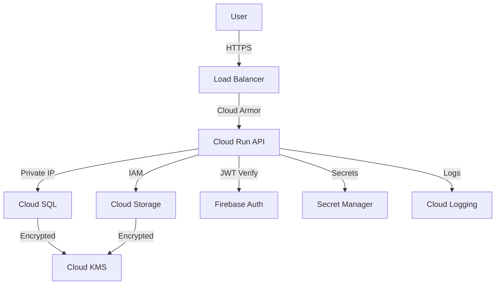

# Security & HIPAA Compliance Guide

Complete security documentation for RevClear, including HIPAA compliance requirements, security controls, and best practices.

---

## 📚 Table of Contents

1. [Overview](#overview)
2. [HIPAA Compliance](#hipaa-compliance)
3. [Security Architecture](#security-architecture)
4. [Authentication & Authorization](#authentication--authorization)
5. [Data Protection](#data-protection)
6. [Security Best Practices](#security-best-practices)
7. [Incident Response](#incident-response)
8. [Compliance Checklist](#compliance-checklist)

---

## 🎯 Overview

RevClear is designed with **Security by Design** and **HIPAA compliance** as core requirements. All Protected Health Information (PHI) is handled according to HIPAA Security and Privacy Rules.

### Key Principles

| Principle | Implementation |
|-----------|----------------|
| **Confidentiality** | Encryption, access controls, authentication |
| **Integrity** | Audit logging, data validation, checksums |
| **Availability** | Redundancy, backups, disaster recovery |

---

## 🏥 HIPAA Compliance

### Covered Information

RevClear handles the following Protected Health Information (PHI):
- Patient demographics (name, DOB, contact info)
- Medical encounter notes (SOAP notes)
- Diagnosis codes (ICD-10)
- Procedure codes (CPT)
- Insurance claims data

### HIPAA Technical Safeguards

#### 1. Access Control (§164.312(a)(1))

**Implementation**:
- ✅ Unique user identification (Firebase Auth UID)
- ✅ Emergency access procedure (Admin override with audit log)
- ✅ Automatic logoff (JWT expiration after 1 hour)
- ✅ Encryption & decryption (TLS 1.3, Cloud KMS)

**Code Example**:
```typescript
// RevClear/backend/src/middleware/auth.ts
export const authMiddleware = async (req, res, next) => {
  const token = req.headers.authorization?.split(' ')[1];
  if (!token) return res.status(401).json({ error: 'No token' });
  
  const decoded = await auth.verifyIdToken(token);
  req.user = decoded; // Unique user ID verified
  next();
};
```

#### 2. Audit Controls (§164.312(b))

**Implementation**:
- ✅ Immutable audit logs (Cloud Logging)
- ✅ 7-year retention period
- ✅ PHI access tracking
- ✅ User activity monitoring

**Code Example**:
```typescript
// RevClear/backend/src/middleware/audit.ts
export const auditLogger = (req, res, next) => {
  const event = {
    timestamp: new Date().toISOString(),
    user: req.user?.uid || 'anonymous',
    action: `${req.method} ${req.path}`,
    ip: req.ip,
    userAgent: req.headers['user-agent']
  };
  
  // Send to Cloud Logging
  console.log(JSON.stringify(event));
  next();
};
```

#### 3. Integrity (§164.312(c)(1))

**Implementation**:
- ✅ Data validation on input
- ✅ Database constraints
- ✅ Audit trail for modifications
- ✅ Checksums for file uploads

**Code Example**:
```typescript
// Input validation
const validatePatient = (data) => {
  if (!data.full_name || data.full_name.length < 2) {
    throw new Error('Invalid patient name');
  }
  if (!isValidDate(data.date_of_birth)) {
    throw new Error('Invalid date of birth');
  }
  // ... more validations
};
```

#### 4. Transmission Security (§164.312(e)(1))

**Implementation**:
- ✅ TLS 1.3 for all communications
- ✅ Encrypted at rest (Cloud KMS)
- ✅ Secure key management
- ✅ Certificate pinning (frontend)

**Configuration**:
```yaml
# Cloud Run TLS enforcement
apiVersion: serving.knative.dev/v1
kind: Service
spec:
  template:
    metadata:
      annotations:
        run.googleapis.com/ingress: internal-and-cloud-load-balancing
        run.googleapis.com/tls: required
```

---

## 🏗️ Security Architecture

### Network Security

```
Internet → Cloud Armor (DDoS) → Load Balancer (TLS)
    → VPC Network (Private)
        → Cloud Run (Backend API)
        → Cloud SQL (Private IP only)
        → Cloud Storage (Encrypted)
```

### Multi-Layer Protection

1. **Perimeter Layer**: Cloud Armor WAF, DDoS protection
2. **Network Layer**: VPC isolation, private endpoints
3. **Application Layer**: Authentication, authorization, input validation
4. **Data Layer**: Encryption at rest, encrypted backups

### GCP Service Architecture



---

## 🔐 Authentication & Authorization

### Firebase Authentication

**Supported Methods**:
- Email/Password with strong password policy
- Google Sign-In (OAuth 2.0)
- Multi-Factor Authentication (MFA) support

**Password Requirements**:
- Minimum 8 characters
- At least one uppercase letter
- At least one number
- At least one special character

### JWT Token Management

**Token Lifecycle**:
1. User logs in → Firebase issues JWT
2. JWT included in `Authorization: Bearer <token>` header
3. Backend verifies JWT on every request
4. Token expires after 1 hour
5. Refresh token used to obtain new JWT

**Security Features**:
- ✅ Token expiration (1 hour)
- ✅ Refresh token rotation
- ✅ Token revocation support
- ✅ Device fingerprinting

### Role-Based Access Control (RBAC)

| Role | Permissions |
|------|-------------|
| **Clinician** | Create patients, encounters, view own data |
| **Biller** | View all claims, submit to clearinghouse |
| **Admin** | Full access, user management, audit logs |

**Implementation**:
```typescript
const checkRole = (requiredRole: string) => {
  return async (req, res, next) => {
    const userRole = req.user.role;
    if (userRole !== requiredRole && userRole !== 'admin') {
      return res.status(403).json({ error: 'Forbidden' });
    }
    next();
  };
};

// Usage
router.get('/admin/users', authMiddleware, checkRole('admin'), listUsers);
```

---

## 🛡️ Data Protection

### Encryption at Rest

**Implementation**:
- Cloud SQL: Encrypted with customer-managed keys (CMEK)
- Cloud Storage: Default encryption + optional CMEK
- Secret Manager: Encrypted by default

**Setup**:
```bash
# Create encryption key
gcloud kms keyrings create hipaa-keyring --location=us-central1

gcloud kms keys create sql-key \
  --location=us-central1 \
  --keyring=hipaa-keyring \
  --purpose=encryption

# Use key for Cloud SQL
gcloud sql instances create medical-db \
  --disk-encryption-key=projects/PROJECT/locations/us-central1/keyRings/hipaa-keyring/cryptoKeys/sql-key
```

### Encryption in Transit

**All Communications**:
- ✅ TLS 1.3 for HTTPS
- ✅ Certificate pinning in mobile apps
- ✅ Mutual TLS (mTLS) for service-to-service

### Data Minimization

**Practices**:
- Only collect necessary PHI
- Anonymize data for analytics
- Auto-delete test data
- Implement data retention policies

**Example Policy**:
```typescript
// Automatically delete old records
const deleteOldRecords = async () => {
  const sevenYearsAgo = new Date();
  sevenYearsAgo.setFullYear(sevenYearsAgo.getFullYear() - 7);
  
  await db.query(
    'DELETE FROM encounters WHERE created_at < $1',
    [sevenYearsAgo]
  );
};
```

---

## 🔒 Security Best Practices

### For Developers

#### 1. Never Commit Secrets

❌ **DON'T**:
```javascript
const API_KEY = "hardcoded-key-123";  // NEVER DO THIS
```

✅ **DO**:
```javascript
const API_KEY = process.env.API_KEY;
```

#### 2. Validate All Input

❌ **DON'T**:
```javascript
const name = req.body.name;  // Dangerous
db.query(`SELECT * FROM users WHERE name = '${name}'`);  // SQL injection!
```

✅ **DO**:
```javascript
const name = sanitize(req.body.name);
db.query('SELECT * FROM users WHERE name = $1', [name]);  // Parameterized query
```

#### 3. Use Environment Variables

**.env file** (local development):
```bash
# Never commit this file!
DB_PASSWORD=secure_password_here
API_KEY=secret_key_here
```

**.gitignore**:
```
.env
.env.local
*.key
*.pem
```

#### 4. Implement Rate Limiting

```typescript
import rateLimit from 'express-rate-limit';

const limiter = rateLimit({
  windowMs: 15 * 60 * 1000, // 15 minutes
  max: 100, // Limit each IP to 100 requests per window
  message: 'Too many requests, please try again later'
});

app.use('/api/', limiter);
```

#### 5. Sanitize Output

```typescript
// Prevent XSS attacks
import DOMPurify from 'dompurify';

const cleanHTML = DOMPurify.sanitize(userInput);
res.send(cleanHTML);
```

### For Deployment

#### 1. Use HTTPS Only

```yaml
# Cloud Run configuration
apiVersion: serving.knative.dev/v1
spec:
  template:
    metadata:
      annotations:
        run.googleapis.com/tls: required  # Force HTTPS
```

#### 2. Restrict Network Access

```bash
# Allow only specific IPs
gcloud compute firewall-rules create allow-office \
  --direction=INGRESS \
  --action=ALLOW \
  --rules=tcp:443 \
  --source-ranges=YOUR_OFFICE_IP/32
```

#### 3. Enable Cloud Armor

```bash
# Create security policy
gcloud compute security-policies create hipaa-policy

# Add rules
gcloud compute security-policies rules create 1000 \
  --security-policy=hipaa-policy \
  --expression="origin.region_code == 'CN'" \
  --action=deny-403
```

#### 4. Configure Logging

```bash
# Set log retention to 7 years (HIPAA requirement)
gcloud logging buckets update _Default \
  --location=global \
  --retention-days=2555  # ~7 years
```

---

## 🚨 Incident Response

### Reporting Security Issues

**Do NOT** create public GitHub issues for security vulnerabilities.

**Contact**:
- Email: security@revclear.team (if established)
- Gannon University IT Security
- Project supervisor: Dr. Davide Piovesan

### Incident Response Plan

1. **Detect**: Monitoring alerts, user reports
2. **Contain**: Isolate affected systems
3. **Investigate**: Review logs, identify breach scope
4. **Remediate**: Patch vulnerabilities, restore systems
5. **Notify**: Inform affected parties (HIPAA Breach Notification Rule)
6. **Document**: Complete incident report
7. **Review**: Post-mortem analysis, improve controls

### HIPAA Breach Notification

If PHI is compromised:
- **Within 60 days**: Notify affected individuals
- **Within 60 days**: Notify HHS (if >500 individuals)
- **Annually**: Report breaches <500 individuals to HHS
- **Without unreasonable delay**: Notify business associates

---

## ✅ Compliance Checklist

### Pre-Production Security Review

- [ ] All secrets moved to Secret Manager
- [ ] No hardcoded credentials in code
- [ ] Input validation on all endpoints
- [ ] SQL injection prevention (parameterized queries)
- [ ] XSS prevention (output sanitization)
- [ ] CSRF protection enabled
- [ ] Rate limiting configured
- [ ] HTTPS/TLS 1.3 enforced
- [ ] JWT token expiration set
- [ ] Audit logging enabled
- [ ] Error messages don't leak sensitive info
- [ ] Database backups configured
- [ ] Encryption at rest enabled (Cloud KMS)
- [ ] Encryption in transit enabled (TLS)
- [ ] VPC network isolation configured
- [ ] Cloud Armor WAF enabled
- [ ] Multi-factor authentication supported
- [ ] Role-based access control implemented
- [ ] Session management secure
- [ ] Third-party dependencies audited

### HIPAA Technical Safeguards

- [ ] Access Control implemented (§164.312(a)(1))
- [ ] Audit Controls enabled (§164.312(b))
- [ ] Integrity controls in place (§164.312(c)(1))
- [ ] Person/Entity Authentication (§164.312(d))
- [ ] Transmission Security enforced (§164.312(e)(1))

### Administrative Safeguards

- [ ] Google Cloud BAA signed
- [ ] Security policies documented
- [ ] Team trained on HIPAA requirements
- [ ] Access review process established
- [ ] Incident response plan documented
- [ ] Risk assessment completed
- [ ] Business continuity plan created

### Physical Safeguards

- [ ] Data center security (Google Cloud)
- [ ] Device/media controls (encrypted storage)
- [ ] Workstation security (developer machines)

---

## 📚 Additional Resources

### Internal Documentation
- **API Security**: `RevClear/backend/Documentation/routes/API_ROUTES.md`
- **Backend Architecture**: `RevClear/backend/ARCHITECTURE.md`
- **HIPAA Compliance (Detailed)**: `RevClear/backend/Documentation/security/HIPAA_COMPLIANCE.md`

### External Resources
- [HIPAA Security Rule](https://www.hhs.gov/hipaa/for-professionals/security/index.html)
- [Google Cloud HIPAA Compliance](https://cloud.google.com/security/compliance/hipaa)
- [OWASP Top 10](https://owasp.org/www-project-top-ten/)
- [NIST Cybersecurity Framework](https://www.nist.gov/cyberframework)

---

## 📞 Security Contacts

**Internal**:
- Security Lead: Aseel Alqoud
- Supervisor: Dr. Davide Piovesan

**External**:
- Gannon University IT Security
- Google Cloud Support (with BAA)

---

**Last Updated**: November 2, 2025  
**Next Review**: Every 6 months or after significant changes  
**Maintained By**: RevClear Security Team
