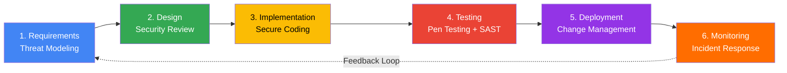

# 🔒 Secure Software Development Lifecycle (SSDLC)

## Overview

RevClear implements a Secure Software Development Lifecycle (SSDLC) to ensure all code, infrastructure, and configurations meet HIPAA security requirements before deployment to production.

**HIPAA Requirement:** § 164.308(a)(8) - Evaluation  
**Objective:** Integrate security practices into every phase of development  
**Scope:** All code, infrastructure, documentation, and configurations

---

## 🌊 6-Phase SSDLC Process



---

## Phase 1: Requirements & Threat Modeling

### 🎯 Objective
Identify security requirements and potential threats BEFORE writing code.

### Activities

#### 1.1 Security Requirements Gathering
For each new feature, document:
- **PHI Handling:** Does this feature access, store, or transmit PHI?
- **Authentication:** Who can access this feature? (roles, permissions)
- **Encryption:** What data needs encryption? (at-rest, in-transit)
- **Audit Logging:** What actions must be logged for compliance?
- **Data Retention:** How long must data be retained?

**Template:** `docs/security_requirements_template.md`

#### 1.2 Threat Modeling (STRIDE Framework)
Use STRIDE methodology to identify threats:
- **S**poofing: Can an attacker impersonate a user?
- **T**ampering: Can data be modified without authorization?
- **R**epudiation: Can a user deny performing an action?
- **I**nformation Disclosure: Can PHI be leaked?
- **D**enial of Service: Can the system be made unavailable?
- **E**levation of Privilege: Can a user gain unauthorized access?

**Tool:** [Microsoft Threat Modeling Tool](https://www.microsoft.com/en-us/securityengineering/sdl/threatmodeling) or draw.io

**Deliverable:** Threat model diagram + risk assessment (High/Medium/Low)

#### 1.3 Review Meeting
- **Attendees:** Product Manager, Tech Lead, Security Champion
- **Duration:** 1 hour
- **Output:** Approved security requirements document

---

## Phase 2: Design & Security Review

### 🎯 Objective
Design secure architecture and validate against HIPAA controls.

### Activities

#### 2.1 Architecture Design
Create design documents including:
- **Data Flow Diagrams:** How does data move through the system?
- **Access Control Matrix:** Who can access what resources?
- **Encryption Strategy:** Which KMS keys protect which data?
- **API Endpoints:** Authentication, authorization, rate limiting

**Example:**
```
Feature: 835 ERA Denial Ingestion
- Input: 835 EDI file (from clearinghouse)
- Processing: Parse denial codes, link to original claims
- Storage: BigQuery (encrypted with ml_training_key)
- Access: Only backend service account
- Audit: Log all file ingestion events
```

#### 2.2 Security Design Review
Security checklist:
- [ ] All PHI encrypted at rest (KMS keys identified)
- [ ] All network traffic encrypted in transit (TLS 1.3)
- [ ] Authentication required for all endpoints
- [ ] Authorization enforced (principle of least privilege)
- [ ] Audit logging captures all PHI access
- [ ] Input validation prevents injection attacks
- [ ] Rate limiting prevents abuse
- [ ] Error messages don't leak sensitive information

**Reviewer:** Security Champion or external consultant (for critical features)

#### 2.3 HIPAA Compliance Check
Map design to HIPAA controls:
| HIPAA Requirement | Implementation |
|-------------------|----------------|
| § 164.312(a)(1) Access Control | Firebase Auth + IAM roles |
| § 164.312(c)(1) Integrity | Checksums + versioning |
| § 164.312(d) Person Authentication | MFA required for admins |
| § 164.312(e)(1) Transmission Security | TLS 1.3, VPN for admins |

**Deliverable:** Approved design document with security sign-off

---

## Phase 3: Implementation & Secure Coding

### 🎯 Objective
Write secure code following best practices and coding standards.

### Activities

#### 3.1 Secure Coding Guidelines

**Authentication & Authorization:**
```typescript
// ✅ GOOD: Verify token on every request
import { verifyFirebaseToken } from '../../middleware/auth';

router.post('/patients', verifyFirebaseToken, async (req, res) => {
  // User verified, safe to proceed
});

// ❌ BAD: No authentication
router.post('/patients', async (req, res) => {
  // Anyone can access this!
});
```

**Input Validation:**
```typescript
// ✅ GOOD: Validate all inputs
import Joi from 'joi';

const patientSchema = Joi.object({
  first_name: Joi.string().max(100).required(),
  dob: Joi.date().max('now').required(),
  ssn: Joi.string().pattern(/^\d{3}-\d{2}-\d{4}$/).required()
});

const { error, value } = patientSchema.validate(req.body);
if (error) {
  return res.status(400).json({ error: error.details });
}

// ❌ BAD: No validation
const { first_name, dob, ssn } = req.body;  // Could be SQL injection!
```

**PHI Redaction in Logs:**
```typescript
// ✅ GOOD: Redact PHI before logging
import { logSafely } from '../utils/logging';

logSafely('Patient created', { 
  patient_id: redactPII(patientId),
  timestamp: new Date() 
});

// ❌ BAD: Log raw PHI
console.log('Patient created:', { name: 'John Doe', ssn: '123-45-6789' });
```

**SQL Injection Prevention:**
```typescript
// ✅ GOOD: Use parameterized queries
const result = await pool.query(
  'SELECT * FROM patients WHERE id = $1',
  [patientId]
);

// ❌ BAD: String concatenation
const result = await pool.query(
  `SELECT * FROM patients WHERE id = '${patientId}'`  // SQL injection vulnerability!
);
```

**Secrets Management:**
```typescript
// ✅ GOOD: Use Secret Manager
import { SecretManagerServiceClient } from '@google-cloud/secret-manager';
const client = new SecretManagerServiceClient();
const [version] = await client.accessSecretVersion({
  name: 'projects/PROJECT_ID/secrets/db-password/versions/latest'
});
const dbPassword = version.payload.data.toString();

// ❌ BAD: Hardcoded secrets
const dbPassword = 'mypassword123';  // NEVER DO THIS!
```

#### 3.2 Code Review Checklist

Every pull request must pass these checks:
- [ ] No hardcoded credentials or secrets
- [ ] All endpoints require authentication
- [ ] Input validation on all user inputs
- [ ] PHI redacted from all logs
- [ ] Error messages don't expose system internals
- [ ] SQL queries use parameterized statements
- [ ] Dependencies up-to-date (no known vulnerabilities)
- [ ] Unit tests cover security edge cases
- [ ] Audit log event created for PHI access

**Reviewer:** At least 1 senior engineer + 1 security champion (for PHI-related code)

#### 3.3 Automated Security Scanning

**Pre-Commit Hook:**
```bash
#!/bin/bash
# .git/hooks/pre-commit

# Scan for secrets
gitleaks detect --source=. --verbose

# Check for known vulnerabilities
npm audit --audit-level=high

# Lint for security issues
npm run lint:security

if [ $? -ne 0 ]; then
  echo "❌ Security scan failed. Fix issues before committing."
  exit 1
fi
```

**CI/CD Pipeline (Cloud Build):**
```yaml
steps:
  # Dependency scanning
  - name: 'node:18'
    entrypoint: 'npm'
    args: ['audit', '--audit-level=high']
  
  # Static code analysis
  - name: 'returntocorp/semgrep'
    args: ['--config=auto', '--error', '.']
  
  # Secret scanning
  - name: 'zricethezav/gitleaks'
    args: ['detect', '--source=.', '--verbose']
```

---

## Phase 4: Testing & Penetration Testing

### 🎯 Objective
Validate security controls and identify vulnerabilities before production.

### Activities

#### 4.1 Security Unit Tests

**Test Authentication:**
```typescript
describe('POST /api/v1/patients', () => {
  it('should reject requests without authentication', async () => {
    const res = await request(app)
      .post('/api/v1/patients')
      .send({ name: 'Test' });
    
    expect(res.status).toBe(401);
    expect(res.body.error).toContain('Authentication required');
  });

  it('should reject requests with invalid token', async () => {
    const res = await request(app)
      .post('/api/v1/patients')
      .set('Authorization', 'Bearer invalid_token')
      .send({ name: 'Test' });
    
    expect(res.status).toBe(403);
  });
});
```

**Test Input Validation:**
```typescript
it('should reject SQL injection attempts', async () => {
  const res = await request(app)
    .get('/api/v1/patients?id=1 OR 1=1')
    .set('Authorization', `Bearer ${validToken}`);
  
  expect(res.status).toBe(400);
  expect(res.body.error).toContain('Invalid input');
});
```

**Test PHI Redaction:**
```typescript
it('should redact PHI from error logs', () => {
  const error = new Error('Patient SSN 123-45-6789 not found');
  const sanitized = redactPII(error.message);
  
  expect(sanitized).not.toContain('123-45-6789');
  expect(sanitized).toContain('[REDACTED]');
});
```

#### 4.2 SAST (Static Application Security Testing)

**Tool:** [Semgrep](https://semgrep.dev/) (open-source SAST)

**Run weekly:**
```bash
semgrep --config=auto --error . --json > sast-report.json
```

**Common findings:**
- SQL injection vulnerabilities
- Cross-site scripting (XSS)
- Insecure deserialization
- Hardcoded secrets
- Weak cryptography

#### 4.3 DAST (Dynamic Application Security Testing)

**Tool:** [OWASP ZAP](https://www.zaproxy.org/) (automated pen testing)

**Run monthly against staging:**
```bash
docker run -v $(pwd):/zap/wrk/:rw -t owasp/zap2docker-stable zap-full-scan.py \
  -t https://staging.revclear.com \
  -r zap-report.html
```

**Tests performed:**
- Authentication bypass attempts
- Authorization escalation
- Input validation (SQL injection, XSS)
- Session management flaws
- CSRF vulnerabilities

#### 4.4 Annual Penetration Testing

**Frequency:** Annually + after major releases  
**Provider:** Third-party security firm (HIPAA requirement)  
**Scope:** Full stack (frontend, backend, infrastructure)

**Deliverable:** Pen test report with:
- Executive summary
- Vulnerabilities found (CVSS scores)
- Proof of concept exploits
- Remediation recommendations
- Retest results

---

## Phase 5: Deployment & Change Management

### 🎯 Objective
Deploy securely with proper approvals and rollback capability.

### Activities

#### 5.1 Pre-Deployment Security Checklist

Before deploying to production:
- [ ] All security tests passed
- [ ] Code review approved by 2+ engineers
- [ ] SAST/DAST scans clean (no high-severity issues)
- [ ] Secrets migrated to Secret Manager
- [ ] Audit logging tested and working
- [ ] Rollback plan documented
- [ ] Security Champion sign-off (for PHI changes)
- [ ] Customer notification prepared (if downtime)

#### 5.2 Change Approval Process

**Low-Risk Changes** (bug fixes, minor updates):
- Peer code review → Auto-deploy to staging → Manual prod deploy

**Medium-Risk Changes** (new features):
- 2 peer reviews → Security review → Deploy to staging → Bake 24 hours → Prod deploy

**High-Risk Changes** (PHI handling, auth changes):
- 2 peer reviews → Security Champion review → CTO approval → Staged rollout (10% → 50% → 100%)

#### 5.3 Deployment Strategy

**Blue-Green Deployment:**
```bash
# Deploy new version to "green" environment
gcloud run deploy backend --image=gcr.io/PROJECT_ID/backend:v2.0 \
  --region=us-central1 \
  --tag=green \
  --no-traffic

# Test green environment
curl https://green---backend-xyz.run.app/health

# Shift 10% traffic to green (canary)
gcloud run services update-traffic backend \
  --to-revisions=green=10,blue=90

# Monitor for 1 hour, then shift 100% if no errors
gcloud run services update-traffic backend \
  --to-revisions=green=100
```

**Rollback Procedure:**
```bash
# Instant rollback to previous version
gcloud run services update-traffic backend \
  --to-revisions=blue=100

# Time to rollback: < 30 seconds
```

#### 5.4 Deployment Audit Trail

Every production deployment must:
1. **Create Jira ticket** with deployment details
2. **Post to #deployments Slack** channel
3. **Log deployment event** in Cloud Logging
4. **Update CHANGELOG.md** with version notes

---

## Phase 6: Monitoring & Incident Response

### 🎯 Objective
Detect security incidents quickly and respond effectively.

### Activities

#### 6.1 Security Monitoring

**Metrics to Monitor:**
| Metric | Threshold | Alert |
|--------|-----------|-------|
| Failed login attempts | >10 per user per hour | Slack #security |
| VPC-SC violations | >0 | PagerDuty |
| DLP findings (PHI in logs) | >0 | PagerDuty |
| Unauthorized API calls (401/403) | >100 per minute | Email |
| Deployment failures | >0 | Slack #deployments |
| Audit log export failures | >0 | PagerDuty |

**Dashboard:** [RevClear Security Dashboard](https://console.cloud.google.com/monitoring)

#### 6.2 Incident Response Drills

**Frequency:** Quarterly  
**Duration:** 2 hours  
**Participants:** Engineering, Security, Compliance, Executive

**Scenarios:**
1. **Data Breach Simulation:** Assume PHI was exposed. Practice:
   - Breach notification process (60-day deadline)
   - Forensic analysis
   - Customer communication
   - Regulatory reporting (HHS OCR)

2. **Ransomware Attack:** Assume systems encrypted. Practice:
   - Restore from backups
   - Incident containment
   - Law enforcement notification

3. **Insider Threat:** Assume employee downloaded PHI. Practice:
   - Access revocation
   - Audit log analysis
   - HR coordination

**Deliverable:** Incident response playbook updates based on lessons learned

#### 6.3 Post-Incident Review

Within 72 hours of any security incident:
1. **Root Cause Analysis:** What happened and why?
2. **Timeline of Events:** Minute-by-minute reconstruction
3. **Impact Assessment:** How much PHI was affected?
4. **Remediation Actions:** What fixes were applied?
5. **Preventative Measures:** How do we prevent this in the future?
6. **HIPAA Breach Notification:** Required if >500 records affected

**Template:** `docs/incident_postmortem_template.md`

#### 6.4 Continuous Improvement

**Weekly Security Review:**
- Review security alerts from past week
- Triage new vulnerabilities (npm audit, CVE alerts)
- Update threat model based on new features

**Monthly Security Meeting:**
- Review incident response drills
- Update security policies
- Security training for new hires

**Quarterly External Audit:**
- Third-party HIPAA compliance audit
- Penetration testing
- SOC 2 Type II audit preparation

---

## 🛠️ Tools & Technologies

| Category | Tool | Purpose |
|----------|------|---------|
| **Threat Modeling** | Microsoft Threat Modeling Tool | STRIDE analysis |
| **Secret Scanning** | Gitleaks | Detect hardcoded secrets |
| **Dependency Scanning** | npm audit, Dependabot | Known vulnerabilities |
| **SAST** | Semgrep, ESLint Security Plugin | Static code analysis |
| **DAST** | OWASP ZAP | Dynamic pen testing |
| **Container Scanning** | Google Artifact Registry | Docker image vulnerabilities |
| **Runtime Protection** | Google Cloud Armor | WAF, DDoS protection |
| **Audit Logging** | Cloud Logging | HIPAA audit trail |
| **Monitoring** | Cloud Monitoring + PagerDuty | Security alerts |
| **Pen Testing** | External firm (annual) | Full stack assessment |

---

## 📚 Training & Awareness

### New Hire Security Training (Required)
- **Duration:** 2 hours
- **Topics:**
  - HIPAA overview
  - PHI handling guidelines
  - Secure coding practices
  - Incident reporting procedures
- **Certification:** Pass quiz with 90% score

### Annual Security Refresher (All Engineers)
- **Duration:** 1 hour
- **Topics:**
  - Recent security incidents (lessons learned)
  - Updated policies
  - New threats (ransomware, supply chain attacks)

### Security Champion Program
- **Eligibility:** Senior engineers with 2+ years experience
- **Responsibilities:**
  - Review security-critical PRs
  - Lead threat modeling sessions
  - Conduct quarterly incident drills
  - Attend monthly security meetings
- **Benefits:**
  - Security certifications (paid by company)
  - Conference attendance
  - Career advancement priority

---

## 📊 SSDLC Metrics

Track these metrics monthly:

| Metric | Target | Current |
|--------|--------|---------|
| % PRs with security review | 100% | — |
| Mean time to fix vulnerabilities (High) | <7 days | — |
| Mean time to fix vulnerabilities (Critical) | <24 hours | — |
| Security training completion rate | 100% | — |
| Incident response drill participation | 100% | — |
| SAST scan coverage | 100% of code | — |
| Dependency vulnerabilities (High+) | 0 | — |

**Dashboard:** Update monthly, review in All-Hands meeting

---

## 🎯 Success Criteria

SSDLC is working if:
- ✅ Zero PHI breaches
- ✅ 100% audit log coverage
- ✅ <24 hour response time for critical vulnerabilities
- ✅ All engineers trained annually
- ✅ No high-severity findings in pen tests
- ✅ HIPAA compliance maintained (annual audit)

---

## 📖 References

- [OWASP SAMM (Software Assurance Maturity Model)](https://owaspsamm.org/)
- [Microsoft Security Development Lifecycle (SDL)](https://www.microsoft.com/en-us/securityengineering/sdl)
- [NIST Secure Software Development Framework (SSDF)](https://csrc.nist.gov/Projects/ssdf)
- [HIPAA Security Rule § 164.308(a)(8)](https://www.hhs.gov/hipaa/for-professionals/security/laws-regulations/index.html)

**Last Updated:** November 1, 2025  
**Owner:** CTO + Security Champion Team  
**Review Schedule:** Quarterly
