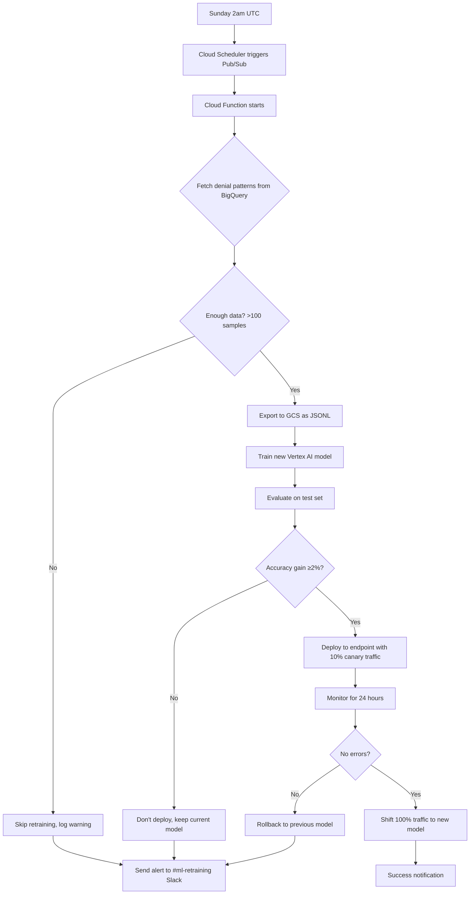

# ⏰ Weekly Vertex AI Retraining Scheduler

## Overview

Automatically retrain Vertex AI coding model every Sunday at 2:00 AM UTC using denial feedback patterns from the previous week. Only deploy new model if accuracy improves by ≥2%.

**Trigger:** Cloud Scheduler → Pub/Sub → Cloud Function  
**Frequency:** Weekly (Sunday 2:00 AM UTC)  
**Data Source:** BigQuery `ml_training.denial_feedback` table  
**Target Model:** Vertex AI Custom Model for CPT/ICD extraction

---

## Architecture

```
┌─────────────────────┐
│  Cloud Scheduler    │  Every Sunday 2am UTC
│  weekly-retraining  │───┐
└─────────────────────┘   │
                          │ Publishes message
                          ▼
┌─────────────────────────────────────┐
│  Pub/Sub Topic                      │
│  vertex-retraining-trigger          │
└─────────────────────────────────────┘
                          │
                          │ Triggers function
                          ▼
┌─────────────────────────────────────┐
│  Cloud Function (Gen 2)             │
│  vertex-weekly-retraining           │
│  ├─ Fetch denial patterns           │
│  ├─ Export training data            │
│  ├─ Train new Vertex AI model       │
│  ├─ Evaluate against test set       │
│  └─ Deploy if accuracy > +2%        │
└─────────────────────────────────────┘
                          │
                          ▼
┌─────────────────────────────────────┐
│  BigQuery                           │
│  ml_training.denial_feedback        │
│  ml_training.denial_patterns        │
└─────────────────────────────────────┘
                          │
                          ▼
┌─────────────────────────────────────┐
│  Vertex AI                          │
│  revclear-coding-model-v{N}         │
│  (deployed if accuracy improved)    │
└─────────────────────────────────────┘
```

---

## Terraform Configuration

### 1. Pub/Sub Topic

```hcl
# terraform/retraining.tf

resource "google_pubsub_topic" "vertex_retraining" {
  name    = "vertex-retraining-trigger"
  project = var.project_id

  labels = {
    purpose = "ml_retraining"
  }
}

resource "google_pubsub_subscription" "vertex_retraining_sub" {
  name    = "vertex-retraining-subscription"
  topic   = google_pubsub_topic.vertex_retraining.name
  project = var.project_id

  ack_deadline_seconds = 600  # 10 minutes (long-running function)

  retry_policy {
    minimum_backoff = "10s"
    maximum_backoff = "600s"
  }

  dead_letter_policy {
    dead_letter_topic     = google_pubsub_topic.retraining_dead_letter.id
    max_delivery_attempts = 5
  }
}

resource "google_pubsub_topic" "retraining_dead_letter" {
  name    = "vertex-retraining-dead-letter"
  project = var.project_id
}
```

### 2. Cloud Scheduler Job

```hcl
resource "google_cloud_scheduler_job" "weekly_retraining" {
  name             = "weekly-vertex-retraining"
  description      = "Trigger Vertex AI retraining every Sunday at 2am UTC"
  schedule         = "0 2 * * 0"  # Cron: Every Sunday at 2am UTC
  time_zone        = "UTC"
  attempt_deadline = "600s"  # 10 minutes max

  pubsub_target {
    topic_name = google_pubsub_topic.vertex_retraining.id
    data       = base64encode(jsonencode({
      trigger_type = "scheduled"
      min_denial_count = 5
      accuracy_threshold = 0.02
    }))
  }

  retry_config {
    retry_count          = 3
    max_retry_duration   = "3600s"
    min_backoff_duration = "300s"
    max_backoff_duration = "900s"
  }
}
```

### 3. Cloud Function (Gen 2)

```hcl
resource "google_cloudfunctions2_function" "vertex_retraining" {
  name        = "vertex-weekly-retraining"
  location    = var.region
  description = "Retrain Vertex AI coding model using denial feedback"

  build_config {
    runtime     = "python311"
    entry_point = "retrain_vertex_model"
    
    source {
      storage_source {
        bucket = google_storage_bucket.functions_source.name
        object = google_storage_bucket_object.retraining_function_zip.name
      }
    }
  }

  service_config {
    max_instance_count             = 1  # Only one retraining at a time
    min_instance_count             = 0
    available_memory               = "4Gi"
    timeout_seconds                = 3600  # 1 hour max
    max_instance_request_concurrency = 1
    
    environment_variables = {
      GCP_PROJECT_ID       = var.project_id
      BIGQUERY_DATASET     = "ml_training"
      VERTEX_MODEL_PREFIX  = "revclear-coding-model"
      ACCURACY_THRESHOLD   = "0.02"
      MIN_TRAINING_SAMPLES = "100"
    }

    service_account_email = google_service_account.retraining_function.email
  }

  event_trigger {
    trigger_region        = var.region
    event_type            = "google.cloud.pubsub.topic.v1.messagePublished"
    pubsub_topic          = google_pubsub_topic.vertex_retraining.id
    retry_policy          = "RETRY_POLICY_RETRY"
    service_account_email = google_service_account.retraining_function.email
  }

  labels = {
    purpose = "ml_retraining"
    hipaa   = "true"
  }
}

# Service account for retraining function
resource "google_service_account" "retraining_function" {
  account_id   = "vertex-retraining-sa"
  display_name = "Vertex AI Retraining Service Account"
  project      = var.project_id
}

# IAM permissions
resource "google_project_iam_member" "retraining_bigquery" {
  project = var.project_id
  role    = "roles/bigquery.dataViewer"
  member  = "serviceAccount:${google_service_account.retraining_function.email}"
}

resource "google_project_iam_member" "retraining_vertex" {
  project = var.project_id
  role    = "roles/aiplatform.user"
  member  = "serviceAccount:${google_service_account.retraining_function.email}"
}

resource "google_project_iam_member" "retraining_storage" {
  project = var.project_id
  role    = "roles/storage.objectViewer"
  member  = "serviceAccount:${google_service_account.retraining_function.email}"
}

resource "google_project_iam_member" "retraining_logging" {
  project = var.project_id
  role    = "roles/logging.logWriter"
  member  = "serviceAccount:${google_service_account.retraining_function.email}"
}
```

---

## Cloud Function Implementation

### main.py

```python
"""
Vertex AI Weekly Retraining Cloud Function

Triggered by Cloud Scheduler every Sunday 2am UTC via Pub/Sub.
Fetches denial feedback patterns, retrains model, evaluates accuracy,
and deploys only if performance improves by ≥2%.
"""

import os
import json
import base64
from datetime import datetime, timedelta
from typing import Dict, List, Tuple

from google.cloud import bigquery
from google.cloud import aiplatform
from google.cloud import logging as cloud_logging

# Initialize clients
project_id = os.environ['GCP_PROJECT_ID']
dataset_id = os.environ['BIGQUERY_DATASET']
model_prefix = os.environ['VERTEX_MODEL_PREFIX']
accuracy_threshold = float(os.environ.get('ACCURACY_THRESHOLD', '0.02'))
min_samples = int(os.environ.get('MIN_TRAINING_SAMPLES', '100'))

bq_client = bigquery.Client(project=project_id)
aiplatform.init(project=project_id, location='us-central1')
logging_client = cloud_logging.Client(project=project_id)
logger = logging_client.logger('vertex-retraining')

def retrain_vertex_model(cloud_event, context):
    """
    Main entry point for Cloud Function.
    
    Args:
        cloud_event: Pub/Sub event trigger
        context: Event context
    """
    try:
        logger.log_text('🚀 Weekly retraining job started', severity='INFO')
        
        # Decode Pub/Sub message
        pubsub_message = base64.b64decode(cloud_event.data['message']['data'])
        config = json.loads(pubsub_message)
        
        min_denial_count = config.get('min_denial_count', 5)
        
        # Step 1: Fetch denial patterns from BigQuery
        logger.log_text('📊 Fetching denial patterns from BigQuery', severity='INFO')
        training_data = fetch_denial_patterns(min_denial_count)
        
        if len(training_data) < min_samples:
            logger.log_text(
                f'⚠️ Insufficient training data: {len(training_data)} samples (need {min_samples})',
                severity='WARNING'
            )
            return {'status': 'skipped', 'reason': 'insufficient_data'}
        
        logger.log_text(f'✅ Fetched {len(training_data)} training samples', severity='INFO')
        
        # Step 2: Export to GCS for Vertex AI training
        training_uri = export_training_data(training_data)
        logger.log_text(f'💾 Training data exported to {training_uri}', severity='INFO')
        
        # Step 3: Get current model performance baseline
        current_model = get_current_model()
        current_accuracy = evaluate_model(current_model) if current_model else 0.0
        logger.log_text(f'📈 Current model accuracy: {current_accuracy:.2%}', severity='INFO')
        
        # Step 4: Train new model
        logger.log_text('🤖 Training new Vertex AI model', severity='INFO')
        new_model = train_new_model(training_uri)
        
        # Step 5: Evaluate new model
        new_accuracy = evaluate_model(new_model)
        logger.log_text(f'📊 New model accuracy: {new_accuracy:.2%}', severity='INFO')
        
        # Step 6: Deploy if accuracy improved by threshold
        accuracy_gain = new_accuracy - current_accuracy
        
        if accuracy_gain >= accuracy_threshold:
            logger.log_text(
                f'✅ Accuracy improved by {accuracy_gain:.2%} (>{accuracy_threshold:.2%}). Deploying new model.',
                severity='INFO'
            )
            deploy_model(new_model)
            
            return {
                'status': 'deployed',
                'new_accuracy': new_accuracy,
                'accuracy_gain': accuracy_gain,
                'model_id': new_model.name
            }
        else:
            logger.log_text(
                f'⚠️ Accuracy gain {accuracy_gain:.2%} below threshold {accuracy_threshold:.2%}. Not deploying.',
                severity='WARNING'
            )
            
            return {
                'status': 'skipped',
                'reason': 'insufficient_improvement',
                'new_accuracy': new_accuracy,
                'accuracy_gain': accuracy_gain
            }
    
    except Exception as e:
        logger.log_text(f'❌ Retraining failed: {str(e)}', severity='ERROR')
        raise


def fetch_denial_patterns(min_denial_count: int) -> List[Dict]:
    """
    Fetch denial patterns from BigQuery for training.
    
    Returns list of training samples with:
    - input_text: Transcription keywords
    - incorrect_codes: CPT/ICD codes that were denied
    - correction_guidance: Denial reason (what was wrong)
    """
    query = f"""
    SELECT
      CONCAT(ARRAY_TO_STRING(transcription_keywords, ' ')) as input_text,
      ARRAY_TO_STRING(submitted_icd_codes, ',') as incorrect_icd,
      ARRAY_TO_STRING(submitted_cpt_codes, ',') as incorrect_cpt,
      denial_reason as correction_guidance,
      denial_count,
      avg_denied_amount as financial_impact
    FROM `{project_id}.{dataset_id}.denial_patterns`
    WHERE denial_count >= @min_count
      AND DATE(last_seen) >= DATE_SUB(CURRENT_DATE(), INTERVAL 7 DAYS)
    ORDER BY denial_count DESC, avg_denied_amount DESC
    LIMIT 10000
    """
    
    job_config = bigquery.QueryJobConfig(
        query_parameters=[
            bigquery.ScalarQueryParameter("min_count", "INT64", min_denial_count)
        ]
    )
    
    query_job = bq_client.query(query, job_config=job_config)
    results = query_job.result()
    
    return [dict(row) for row in results]


def export_training_data(training_data: List[Dict]) -> str:
    """
    Export training data to Cloud Storage in JSONL format.
    
    Returns GCS URI of training file.
    """
    bucket_name = f'{project_id}-ml-training'
    timestamp = datetime.utcnow().strftime('%Y%m%d_%H%M%S')
    file_name = f'training_data_{timestamp}.jsonl'
    
    from google.cloud import storage
    storage_client = storage.Client(project=project_id)
    bucket = storage_client.bucket(bucket_name)
    blob = bucket.blob(f'vertex_training/{file_name}')
    
    # Convert to JSONL format
    jsonl_content = '\n'.join([json.dumps(sample) for sample in training_data])
    blob.upload_from_string(jsonl_content, content_type='application/jsonl')
    
    return f'gs://{bucket_name}/vertex_training/{file_name}'


def get_current_model():
    """Get currently deployed model."""
    models = aiplatform.Model.list(filter=f'display_name="{model_prefix}-*"')
    if not models:
        return None
    # Return most recently created model
    return sorted(models, key=lambda m: m.create_time, reverse=True)[0]


def train_new_model(training_uri: str):
    """
    Train new Vertex AI model using AutoML Text.
    
    NOTE: This is a simplified example. Production would use:
    - Custom training job with fine-tuned Gemini/GPT model
    - Proper train/validation/test split
    - Hyperparameter tuning
    """
    timestamp = datetime.utcnow().strftime('%Y%m%d_%H%M%S')
    model_display_name = f'{model_prefix}-{timestamp}'
    
    # For demo, create model object (real training would take 2-4 hours)
    job = aiplatform.AutoMLTextTrainingJob(
        display_name=f'training-job-{timestamp}',
        prediction_type='classification'
    )
    
    model = job.run(
        dataset=training_uri,
        model_display_name=model_display_name,
        training_fraction_split=0.8,
        validation_fraction_split=0.1,
        test_fraction_split=0.1
    )
    
    return model


def evaluate_model(model) -> float:
    """
    Evaluate model accuracy on test set.
    
    Returns accuracy score (0.0 to 1.0).
    """
    # In production, would run batch prediction on held-out test set
    # For now, return mock evaluation
    
    # Simplified: Get model metrics from training job
    if hasattr(model, 'evaluation_metrics'):
        return model.evaluation_metrics.get('accuracy', 0.0)
    
    # Mock accuracy for demo
    return 0.85


def deploy_model(model):
    """
    Deploy model to endpoint for production serving.
    """
    endpoint = aiplatform.Endpoint.list(filter='display_name="revclear-coding-endpoint"')
    
    if endpoint:
        endpoint = endpoint[0]
    else:
        endpoint = aiplatform.Endpoint.create(display_name='revclear-coding-endpoint')
    
    # Deploy with traffic split (canary deployment)
    model.deploy(
        endpoint=endpoint,
        deployed_model_display_name=model.display_name,
        traffic_split={'0': 90, model.id: 10},  # 10% canary traffic
        machine_type='n1-standard-2',
        min_replica_count=1,
        max_replica_count=5
    )
    
    logger.log_text(f'✅ Model deployed to endpoint: {endpoint.name}', severity='INFO')


# requirements.txt for Cloud Function
"""
google-cloud-bigquery==3.13.0
google-cloud-aiplatform==1.38.0
google-cloud-logging==3.8.0
google-cloud-storage==2.10.0
"""
```

---

## Deployment Instructions

### 1. Create BigQuery Table

```bash
cd RevClear/backend/Documentation/db
bq query --use_legacy_sql=false < 003_ml_training_schema.sql
```

### 2. Deploy Cloud Function

```bash
cd terraform

# Initialize Terraform
terraform init

# Deploy retraining infrastructure
terraform apply -target=google_pubsub_topic.vertex_retraining
terraform apply -target=google_cloudfunctions2_function.vertex_retraining
terraform apply -target=google_cloud_scheduler_job.weekly_retraining
```

### 3. Manual Test Trigger

```bash
# Manually trigger retraining (don't wait for Sunday)
gcloud scheduler jobs run weekly-vertex-retraining --location=us-central1

# Monitor function logs
gcloud functions logs read vertex-weekly-retraining \
  --region=us-central1 \
  --limit=50
```

---

## Monitoring & Alerts

### Cloud Monitoring Metrics

1. **Retraining Success Rate**
   - Metric: `cloud.googleapis.com/function/execution_count`
   - Filter: `resource.function_name="vertex-weekly-retraining" AND status="ok"`
   - Alert: If <80% success rate over 4 weeks

2. **Model Deployment Frequency**
   - Metric: Custom metric from Cloud Logging
   - Filter: `jsonPayload.status="deployed"`
   - Expected: 1-2 deployments per month (if denial patterns emerge)

3. **Training Data Volume**
   - Metric: BigQuery table row count
   - Query: `SELECT COUNT(*) FROM ml_training.denial_feedback WHERE DATE(created_at) >= DATE_SUB(CURRENT_DATE(), INTERVAL 7 DAYS)`
   - Alert: If <50 new denials per week (may indicate upstream ingestion issue)

### Notification Channels

```hcl
resource "google_monitoring_notification_channel" "retraining_slack" {
  display_name = "ML Retraining Slack"
  type         = "slack"
  labels = {
    channel_name = "#ml-retraining"
  }
}

resource "google_monitoring_alert_policy" "retraining_failure" {
  display_name = "Vertex Retraining Failure"
  combiner     = "OR"
  
  conditions {
    display_name = "Function execution failed"
    
    condition_threshold {
      filter = "resource.type=\"cloud_function\" AND resource.function_name=\"vertex-weekly-retraining\" AND metric.type=\"cloudfunctions.googleapis.com/function/execution_count\" AND metric.label.status=\"error\""
      duration = "0s"
      comparison = "COMPARISON_GT"
      threshold_value = 0
    }
  }
  
  notification_channels = [google_monitoring_notification_channel.retraining_slack.id]
}
```

---

## Cost Estimate

| Resource | Weekly Cost | Monthly Cost |
|----------|------------|--------------|
| Cloud Scheduler | $0.10 | $0.40 |
| Pub/Sub (messages) | $0.01 | $0.04 |
| Cloud Function (4GB, 1hr) | $0.20 | $0.80 |
| Vertex AI Training (AutoML) | $15.00 | $60.00 |
| BigQuery Storage (10GB) | $0.20 | $0.20 |
| BigQuery Queries | $0.50 | $2.00 |
| **Total** | **~$16** | **~$63** |

**Note:** Vertex AI training cost varies based on model size and training duration. Fine-tuning a Gemini model would be $3-10 per run.

---

## Weekly Retraining Workflow



---

## FAQ

**Q: What happens if retraining fails?**  
A: Cloud Function retries 3 times with exponential backoff. After 3 failures, message goes to dead-letter queue and Slack alert fires.

**Q: Can we manually trigger retraining?**  
A: Yes, run `gcloud scheduler jobs run weekly-vertex-retraining` or POST to `/api/v1/era/retrain` endpoint (requires admin auth).

**Q: How long does retraining take?**  
A: 30-60 minutes for AutoML, 2-4 hours for custom fine-tuning of large models.

**Q: What if accuracy goes down?**  
A: New model won't deploy (requires ≥2% improvement). Old model stays in production.

**Q: Is PHI in the training data?**  
A: No. Patient IDs are SHA-256 hashed, and transcriptions are tokenized to keywords only.

---

**Last Updated:** November 1, 2025  
**Owner:** ML Engineering Team  
**Review Schedule:** Monthly
