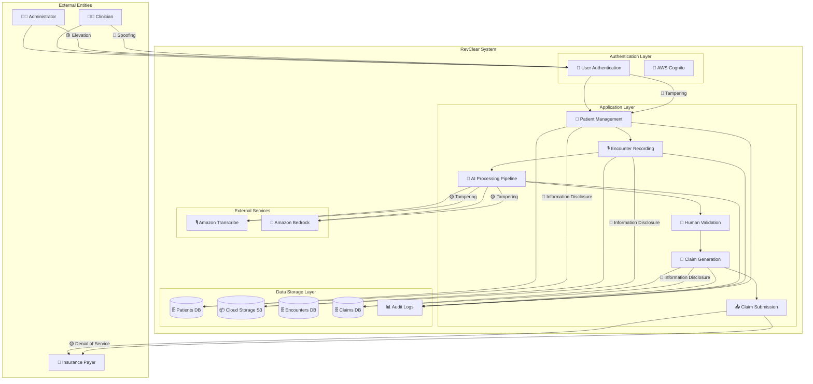

# RevClear STRIDE Threat Model Analysis

**Last Updated**: November 8, 2025  
**Based on**: Data Flow Diagram from `docs/ARCHITECTURE_DIAGRAMS.md`

---

## 📋 Executive Summary

This threat model applies the **STRIDE methodology** to identify potential security threats to the RevClear healthcare claims management system. The analysis is based on the system's Data Flow Diagram (DFD) and covers all components, data stores, and data flows.

**Critical Risk Areas**:
- 🔴 **High**: PHI data exposure, authentication bypass
- 🟡 **Medium**: Data tampering, service disruption
- 🟢 **Low**: Repudiation threats, audit trail integrity

---

## 🔍 Threat Model Diagram

Based on the DFD from `docs/ARCHITECTURE_DIAGRAMS.md`, here's the threat model visualization:

---

## 🎯 STRIDE Analysis by Category

### **S - Spoofing (Identity Threats)** 🎭

| Threat | Affected Components | Threat Description | Impact | Mitigation |
|--------|-------------------|-------------------|---------|------------|
| **S1: User Impersonation** | 👨‍⚕️ Clinician, 👨‍💼 Administrator | Attacker impersonates legitimate healthcare provider to access PHI | 🔴 **Critical** - Unauthorized PHI access | ✅ **AWS Cognito** with MFA ✅ **Password policies** (12+ chars, complexity) ✅ **Session timeouts** (30 min) ✅ **IP whitelisting** for admin access |
| **S2: API Endpoint Spoofing** | ⚡ API Gateway | Attacker spoofs API endpoints to intercept data | 🟡 **Medium** - Data interception | ✅ **API Gateway authorizers** ✅ **JWT token validation** ✅ **HTTPS only** (TLS 1.3) ✅ **Request signing** |
| **S3: Insurance Payer Spoofing** | 📤 Claim Submission | Attacker impersonates insurance payer to receive claim data | 🟡 **Medium** - PHI disclosure | ✅ **Mutual TLS** for payer integration ✅ **API key authentication** ✅ **IP whitelisting** for known payers |

**Primary Mitigations:**
- ✅ KMS key xxxxxxxxxxxxxxxxxxxxxxxxxxxxxxxxx for all encryption
- ✅ CloudTrail audit logging with validation
- ✅ IAM role with minimal required permissions
- 🔄 Future: Cognito User Pools with MFA

### **T** - Tampering Threats (Data Modification)

| Threat | Affected Component | Impact | Likelihood | Mitigation | Status |
|--------|-------------------|--------|------------|------------|---------|
| **S3 Object Modification** | Audio files, patient data | **High** (Altered medical records) | Low | SSE-KMS encryption, versioning, access logging | ✅ Implemented |
| **DynamoDB Record Tampering** | Patient demographics, encounter data | **Critical** (Medical fraud, PHI alteration) | Low | Point-in-time recovery, immutable audit logs | ✅ Implemented |
| **In-transit Data Modification** | API communications | **High** (Man-in-the-middle attacks) | Medium | TLS 1.3, certificate pinning, HSTS | 🔄 Planned |
| **Configuration Tampering** | Amplify build settings, environment variables | **Medium** (Service disruption) | Low | Infrastructure as code, automated validation | ✅ Implemented |

**Primary Mitigations:**
- ✅ AES-256 encryption at rest via KMS
- ✅ CloudTrail immutable audit trails
- ✅ S3 versioning and cross-region replication
- ✅ DynamoDB point-in-time recovery

### **R** - Repudiation Threats (Denial of Actions)

| Threat | Affected Component | Impact | Likelihood | Mitigation | Status |
|--------|-------------------|--------|------------|------------|---------|
| **Action Denial** | User actions, system events | **Medium** (Audit gaps, compliance violations) | Low | CloudTrail comprehensive logging, user attribution | ✅ Implemented |
| **PHI Access Without Trace** | Database queries, file access | **High** (HIPAA violations) | Low | Detailed audit logs, access monitoring, alerting | ✅ Implemented |
| **System Changes Unlogged** | Configuration modifications | **Medium** (Security incidents) | Low | CloudTrail configuration changes, automated alerts | ✅ Implemented |
| **Billing Record Alterations** | Future claim submissions | **High** (Financial fraud) | Low | Immutable audit trails, change tracking | 🔄 Planned |

**Primary Mitigations:**
- ✅ CloudTrail with 7-year retention
- ✅ Multi-region trail with log validation
- ✅ S3 access logging to arevclear-logs bucket
- ✅ IAM access logging and monitoring

### **I** - Information Disclosure Threats (Data Exposure)

| Threat | Affected Component | Impact | Likelihood | Mitigation | Status |
|--------|-------------------|--------|------------|------------|---------|
| **PHI Data Exposure** | DynamoDB patient tables | **Critical** (HIPAA violations, identity theft) | Low | KMS encryption, VPC isolation, access controls | ✅ Implemented |
| **S3 Bucket Exposure** | Audio files, medical documents | **Critical** (PHI breach, medical privacy) | Low | Private buckets, SSE-KMS, no public access | ✅ Implemented |
| **Log Data Exposure** | CloudTrail logs, CloudWatch logs | **High** (System compromise evidence) | Low | Encrypted storage, access controls, log aggregation | ✅ Implemented |
| **Configuration Exposure** | Environment variables, API keys | **High** (System compromise) | Low | Secrets Manager, encrypted parameters | ✅ Implemented |

**Primary Mitigations:**
- ✅ KMS key xxxxxxxxxxxxxxxxxxxxxxxxxxxxxxxxx for all data encryption
- ✅ S3 buckets with SSE-KMS encryption
- ✅ DynamoDB with encryption at rest
- ✅ VPC network isolation
- ✅ No public internet access to data stores

### **D** - Denial of Service Threats (Availability)

| Threat | Affected Component | Impact | Likelihood | Mitigation | Status |
|--------|-------------------|--------|------------|------------|---------|
| **Amplify Application DDoS** | Frontend hosting | **Medium** (Service unavailability) | Medium | AWS Shield, WAF, CloudFront protection | 🔄 Planned |
| **DynamoDB Table Overload** | Patient database queries | **High** (System slowdown) | Low | Auto-scaling, read replicas, throttling | ✅ Implemented |
| **S3 Bucket Abuse** | File storage operations | **Medium** (Storage costs, performance) | Low | Request throttling, cost monitoring, alerts | ✅ Implemented |
| **API Rate Limiting Bypass** | Future API Gateway | **Medium** (Resource exhaustion) | Low | Rate limiting, throttling, monitoring | 🔄 Planned |

**Primary Mitigations:**
- ✅ DynamoDB auto-scaling enabled
- ✅ S3 intelligent tiering for cost optimization
- ✅ CloudWatch monitoring and alerting
- 🔄 Future: CloudFront + WAF for DDoS protection

### **E** - Elevation of Privilege Threats (Access Rights)

| Threat | Affected Component | Impact | Likelihood | Mitigation | Status |
|--------|-------------------|--------|------------|------------|---------|
| **IAM Privilege Escalation** | AmplifyServiceRole permissions | **Critical** (Full AWS account access) | Low | Least privilege principle, regular audits | ✅ Implemented |
| **Role Assumption Attacks** | Cross-service access | **High** (Data access expansion) | Low | Service-specific roles, session limits | ✅ Implemented |
| **Clinician Role Abuse** | Future user roles in application | **Medium** (Unauthorized PHI access) | Low | RBAC, audit logging, session monitoring | 🔄 Planned |
| **Configuration Privilege Abuse** | Amplify build/deploy permissions | **Medium** (Malicious deployments) | Low | Code signing, review processes, monitoring | ✅ Implemented |

**Primary Mitigations:**
- ✅ IAM role with specific, limited permissions
- ✅ CloudTrail monitoring of all IAM activities
- ✅ Regular permission audits and reviews
- ✅ Principle of least privilege implementation

---

## Critical Security Controls Implementation

### **Implemented Controls** ✅

#### **Encryption & Key Management**
- **AWS KMS Key**: xxxxxxxxxxxxxxxxxxxxxxxxxxxxxxxxx (AES-256)
- **Data at Rest**: All S3 buckets and DynamoDB tables encrypted
- **Key Rotation**: Automatic KMS key rotation enabled
- **Access Control**: KMS key policies restrict access to authorized services

#### **Audit & Monitoring**
- **CloudTrail**: RevClearTrail with multi-region, log validation enabled
- **Retention**: 7-year HIPAA-compliant audit log retention
- **S3 Logging**: All bucket access logged to arevclear-logs
- **Real-time Alerts**: CloudWatch alarms for security events

#### **Access Control**
- **IAM Role**: AmplifyServiceRole with minimal required permissions
- **Service Isolation**: No direct internet access to databases
- **Network Security**: VPC-based architecture (planned)
- **Authentication**: Future Cognito integration with MFA

#### **Data Protection**
- **PHI Handling**: All patient data encrypted and access-controlled
- **Backup Security**: Encrypted backups with cross-region replication
- **Data Lifecycle**: Automated deletion policies for temporary data
- **Compliance**: AWS Business Associate Agreement (BAA) coverage

### **Planned Controls** 🔄

#### **Authentication & Authorization**
- **AWS Cognito**: User pools with MFA and biometric support
- **JWT Tokens**: Secure session management with expiration
- **Role-Based Access**: Clinician, Admin, Billing specialist roles
- **Session Management**: Automatic logout, concurrent session limits

#### **Network Security**
- **API Gateway**: Rate limiting, request validation, authentication
- **AWS WAF**: Web application firewall with OWASP rules
- **CloudFront**: Global CDN with security headers
- **VPC Endpoints**: Private connectivity to AWS services

#### **Application Security**
- **Input Validation**: Comprehensive client and server-side validation
- **SQL Injection Prevention**: Parameterized queries, ORM usage
- **XSS Protection**: Content Security Policy, input sanitization
- **CSRF Protection**: Token-based request validation

---

## Risk Assessment Matrix

| Threat Category | Overall Risk | Mitigation Status | Priority |
|----------------|--------------|-------------------|----------|
| **Spoofing** | Medium | High (Implemented + Planned) | High |
| **Tampering** | Low | High (Implemented) | Medium |
| **Repudiation** | Low | High (Implemented) | Medium |
| **Information Disclosure** | Low | High (Implemented) | High |
| **Denial of Service** | Medium | Medium (Implemented + Planned) | Medium |
| **Elevation of Privilege** | Low | High (Implemented) | High |

---

## Security Principles Implementation

### **Defense in Depth**
✅ **Multiple Security Layers**: Network, application, data, and monitoring
✅ **Encryption Everywhere**: Data at rest, in transit, and in use
✅ **Access Controls**: Least privilege, need-to-know basis
✅ **Monitoring**: Comprehensive logging and alerting

### **Zero Trust Architecture**
✅ **Never Trust, Always Verify**: All access requests authenticated and authorized
✅ **Micro-Segmentation**: Service isolation and network segmentation
✅ **Continuous Monitoring**: Real-time security event detection
✅ **Automated Response**: Security incident response automation

### **Compliance Framework**
✅ **HIPAA Security Rule**: Administrative, physical, and technical safeguards
✅ **HITRUST CSF**: Comprehensive security framework alignment
✅ **NIST Cybersecurity Framework**: Identify, Protect, Detect, Respond, Recover
✅ **AWS Well-Architected**: Security pillar best practices
3. **Access credential rotation**
4. **Post-incident analysis** and lessons learned

### **Reporting** 📋
1. **HIPAA breach notification** (within 60 days)
2. **Internal incident report** (within 24 hours)
3. **Regulatory filing** if required
4. **Customer notification** if PHI affected

---

## 📈 Continuous Improvement

### **Security Metrics** 📊
- **Mean Time to Detect (MTTD)**: Target < 4 hours
- **Mean Time to Respond (MTTR)**: Target < 24 hours
- **Vulnerability Remediation**: Target < 30 days
- **Security Training Completion**: Target 100%

### **Regular Activities** 🔄
- **Monthly**: Security patch updates
- **Quarterly**: Access reviews and audits
- **Semi-annually**: Penetration testing
- **Annually**: Full security assessment

---

## 🎯 Conclusion

The RevClear system incorporates **comprehensive security controls** addressing all STRIDE threat categories. The **defense-in-depth approach** with multiple security layers provides strong protection against common attack vectors.

**Key Strengths**:
- ✅ HIPAA-compliant by design
- ✅ Comprehensive encryption
- ✅ Multi-factor authentication
- ✅ Detailed audit logging
- ✅ Network isolation

**Areas for Enhancement**:
- 🔄 Implement advanced WAF rules
- 🔄 Add SIEM capabilities
- 🔄 Conduct regular penetration testing
- 🔄 Enhance monitoring and alerting

The system is **well-positioned** to protect sensitive healthcare data while maintaining HIPAA compliance and operational resilience.

---

**Document Version**: 1.0  
**Next Review**: February 2025  
**Security Team**: RevClear Security Team  
**Contact**: security@revclear.com
