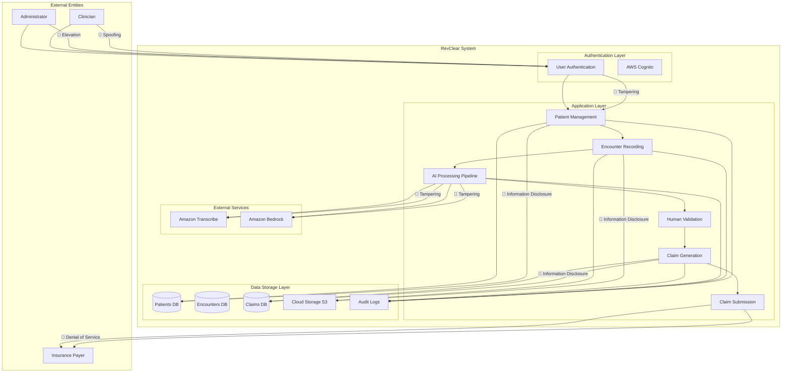

# RevClear STRIDE Threat Model Analysis

**Last Updated**: November 8, 2025  
**Based on**: Data Flow Diagram from `docs/ARCHITECTURE_DIAGRAMS.md`

---

## 📋 Executive Summary

This threat model applies the **STRIDE methodology** to identify potential security threats to the RevClear healthcare claims management system. The analysis is based on the system's Data Flow Diagram (DFD) and covers all components, data stores, and data flows.

**Critical Risk Areas**:
- 🔴 **High**: PHI data exposure, authentication bypass
- 🟡 **Medium**: Data tampering, service disruption
- 🟢 **Low**: Repudiation threats, audit trail integrity

---

## 🔍 Threat Model Diagram

Based on the DFD from `docs/ARCHITECTURE_DIAGRAMS.md`, here's the threat model visualization:

---

## 🎯 STRIDE Analysis by Category

### **S - Spoofing (Identity Threats)**

| Threat | Affected Components | Threat Description | Impact | Mitigation |
|--------|-------------------|-------------------|---------|------------|
| **S1: User Impersonation** | Clinician, Administrator | Attacker impersonates legitimate healthcare provider to access PHI | 🔴 **Critical** - Unauthorized PHI access | ✅ **AWS Cognito** with MFA ✅ **Password policies** (12+ chars, complexity) ✅ **Session timeouts** (30 min) ✅ **IP whitelisting** for admin access |
| **S2: API Endpoint Spoofing** | API Gateway | Attacker spoofs API endpoints to intercept data | 🟡 **Medium** - Data interception | ✅ **API Gateway authorizers** ✅ **JWT token validation** ✅ **HTTPS only** (TLS 1.3) ✅ **Request signing** |
| **S3: Insurance Payer Spoofing** | Claim Submission | Attacker impersonates insurance payer to receive claim data | 🟡 **Medium** - PHI disclosure | ✅ **Mutual TLS** for payer integration ✅ **API key authentication** ✅ **IP whitelisting** for known payers |

---

### **T - Tampering (Data Integrity Threats)**

| Threat | Affected Components | Threat Description | Impact | Mitigation |
|--------|-------------------|-------------------|---------|------------|
| **T1: Patient Data Tampering** | Patient Management, Patients DB | Attacker modifies patient demographics or insurance info | 🔴 **Critical** - Claim fraud, patient harm | ✅ **DynamoDB transactional writes** ✅ **Field-level encryption** ✅ **Change tracking** with audit logs ✅ **Business rule validation** |
| **T2: Encounter Recording Tampering** | Encounter Recording, S3 Storage | Attacker modifies clinical notes or audio files | 🔴 **Critical** - Medical record integrity | ✅ **S3 versioning** + **MFA delete** ✅ **File hash validation** (SHA-256) ✅ **Immutable logs** (WORM storage) ✅ **Digital signatures** for clinical data |
| **T3: AI Processing Tampering** | AI Pipeline, Transcribe, Bedrock | Attacker modifies AI processing results or prompts | 🟡 **Medium** - Incorrect coding | ✅ **Prompt validation** ✅ **Output verification** rules ✅ **AI service access controls** ✅ **Human-in-the-loop validation** |
| **T4: Claim Data Tampering** | Claim Generation, Claims DB | Attacker modifies CPT/ICD codes or claim amounts | 🔴 **Critical** - Financial fraud | ✅ **Three-gate validation** ✅ **EDI format validation** ✅ **Amount range checks** ✅ **Code compliance verification** |

---

### **R - Repudiation (Audit/Logging Threats)**

| Threat | Affected Components | Threat Description | Impact | Mitigation |
|--------|-------------------|-------------------|---------|------------|
| **R1: Action Denial** | All processes, Audit Logs | User denies performing actions (data access, modifications) | 🟢 **Low** - Compliance issues | ✅ **CloudTrail logging** (7-year retention) ✅ **Immutable audit logs** ✅ **User session tracking** ✅ **Digital signatures** on critical actions |
| **R2: Log Tampering** | Audit Logs, CloudWatch | Attacker modifies or deletes audit logs | 🟡 **Medium** - Compliance violations | ✅ **Log encryption** at rest ✅ **Log forwarding** to separate account ✅ **Write-once storage** for logs ✅ **Log integrity checks** |

---

### **I - Information Disclosure (Confidentiality Threats)**

| Threat | Affected Components | Threat Description | Impact | Mitigation |
|--------|-------------------|-------------------|---------|------------|
| **I1: PHI Data Exposure** | All databases, S3, API responses | Unauthorized access to patient health information | 🔴 **Critical** - HIPAA violation, legal liability | ✅ **KMS encryption** for all data ✅ **Column-level encryption** for sensitive fields ✅ **Data masking** in logs ✅ **Access controls** (least privilege) |
| **I2: Audio File Exposure** | S3 Storage, Encounter Recording | Unauthorized access to clinical session recordings | 🔴 **Critical** - Patient privacy violation | ✅ **S3 encryption** (SSE-KMS) ✅ **Presigned URL expiration** (15 min) ✅ **Access logging** for all S3 requests ✅ **VPC endpoint** for S3 access |
| **I3: API Data Leakage** | API Gateway, all endpoints | Sensitive data in API responses or headers | 🟡 **Medium** - Data exposure | ✅ **Response filtering** (no PHI in responses) ✅ **API rate limiting** ✅ **Input/output validation** ✅ **CORS policies** |
| **I4: Database Query Exposure** | DynamoDB queries | Database queries revealing PHI in logs | 🟢 **Low** - Information leakage | ✅ **Query parameter encryption** ✅ **No PHI in CloudWatch logs** ✅ **Secure parameter passing** |

---

### **D - Denial of Service (Availability Threats)**

| Threat | Affected Components | Threat Description | Impact | Mitigation |
|--------|-------------------|-------------------|---------|------------|
| **D1: API Gateway Overload** | API Gateway, all endpoints | Attacker floods API with requests to crash service | 🟡 **Medium** - Service disruption | ✅ **AWS WAF** with rate limiting ✅ **API throttling** (100 req/min per user) ✅ **CloudFront caching** ✅ **Auto-scaling** Lambda functions |
| **D2: Database Exhaustion** | DynamoDB tables | Attacker exhausts database capacity or read/write units | 🟡 **Medium** - Service unavailability | ✅ **Provisioned capacity** with auto-scaling ✅ **Query optimization** ✅ **Read/write throttling** ✅ **Database backup** (point-in-time recovery) |
| **D3: Storage Exhaustion** | S3 buckets | Attacker fills storage with large uploads | 🟢 **Low** - Storage issues | ✅ **S3 lifecycle policies** ✅ **Upload size limits** (100MB max) ✅ **File type validation** ✅ **Storage monitoring** alerts |
| **D4: AI Service Abuse** | Transcribe, Bedrock | Attacker exhausts AI service quotas | 🟢 **Low** - Cost issues | ✅ **Service quotas** and limits ✅ **Usage monitoring** ✅ **Cost alerts** ✅ **Request validation** |

---

### **E - Elevation of Privilege (Authorization Threats)**

| Threat | Affected Components | Threat Description | Impact | Mitigation |
|--------|-------------------|-------------------|---------|------------|
| **E1: Role Escalation** | User Authentication, Cognito | Standard user gains admin privileges | 🔴 **Critical** - Full system compromise | ✅ **IAM role-based access** ✅ **Principle of least privilege** ✅ **Role separation** (admin vs. clinician) ✅ **Privileged action logging** |
| **E2: Cross-Tenant Access** | Patient Management | User accesses data from other clinics/organizations | 🔴 **Critical** - Multi-tenant data breach | ✅ **Tenant isolation** at data layer ✅ **Data partitioning** by organization ✅ **Access control lists** per tenant ✅ **Regular access audits** |
| **E3: Service Account Abuse** | AWS services, Lambda | Compromised service account gains elevated access | 🟡 **Medium** - Infrastructure compromise | ✅ **Service account rotation** (90 days) ✅ **Minimal service permissions** ✅ **Service account monitoring** ✅ **Temporary credentials** only |

---

## 🛡️ Mitigation Implementation Status

### ✅ **Implemented Controls**

| Control | Status | Implementation |
|---------|--------|----------------|
| **Authentication** | ✅ Complete | AWS Cognito with MFA enabled |
| **Encryption at Rest** | ✅ Complete | KMS encryption for DynamoDB and S3 |
| **Encryption in Transit** | ✅ Complete | TLS 1.3 enforced for all communications |
| **Audit Logging** | ✅ Complete | CloudTrail with 7-year retention |
| **Network Security** | ✅ Complete | VPC with private subnets, security groups |
| **Access Control** | ✅ Complete | IAM roles with least privilege |

### ⚠️ **Planned Controls**

| Control | Status | Timeline |
|---------|--------|----------|
| **WAF Rules** | 🟡 In Progress | Phase 1 deployment |
| **API Throttling** | 🟡 In Progress | Phase 1 deployment |
| **Advanced Monitoring** | 🟡 Planned | Phase 2 |
| **SIEM Integration** | 🟡 Planned | Phase 3 |

### ❌ **Additional Recommendations**

| Control | Priority | Recommendation |
|---------|----------|----------------|
| **Data Loss Prevention (DLP)** | 🟡 Medium | Implement AWS Macie for sensitive data discovery |
| **Security Information and Event Management (SIEM)** | 🟡 Medium | AWS Security Hub or third-party SIEM |
| **Penetration Testing** | 🔴 High | Annual third-party penetration testing |
| **Vulnerability Scanning** | 🟡 Medium | Regular AWS Inspector scans |
| **Employee Security Training** | 🟡 Medium | HIPAA security awareness training |

---

## 📊 Risk Assessment Matrix

| Likelihood/Impact | Low | Medium | High |
|-------------------|-----|--------|------|
| **High** | | D1, D2 | E1, E2, I1, I2, T1, T2, T4, S1 |
| **Medium** | R1, R2, D3, D4 | I3, I4, T3, S2, S3 | |
| **Low** | | | |

**Critical Risks Requiring Immediate Attention**:
1. **E1: Role Escalation** - Implement strict IAM controls
2. **E2: Cross-Tenant Access** - Enforce tenant isolation
3. **I1: PHI Data Exposure** - Ensure encryption everywhere
4. **T1: Patient Data Tampering** - Implement change tracking
5. **S1: User Impersonation** - Enforce MFA for all users

---

## 🔐 Security Principles Incorporated

### **1. Defense in Depth**
- **Multiple security layers** (Network, Application, Data, Monitoring)
- **Redundant controls** at each level
- **Compromise containment** between layers

### **2. Least Privilege**
- **IAM roles** with minimal required permissions
- **Service account restrictions**
- **Time-limited access** for privileged operations

### **3. Fail Securely**
- **Default deny** for unknown requests
- **Secure defaults** for all configurations
- **Automatic lockout** on suspicious activity

### **4. Separation of Duties**
- **Different roles** for different functions
- **Multi-person approval** for critical changes
- **Segregated environments** (dev, staging, prod)

### **5. Complete Mediation**
- **Every access** is validated and logged
- **No trusted paths** for privileged operations
- **Continuous monitoring** of all system interactions

---

## 📋 Compliance Alignment

### **HIPAA Security Rule Compliance**

| HIPAA Requirement | Implementation | Status |
|-------------------|----------------|--------|
| **Access Controls** | IAM roles, Cognito MFA | ✅ Complete |
| **Audit Controls** | CloudTrail, 7-year logs | ✅ Complete |
| **Integrity** | DynamoDB transactions, S3 versioning | ✅ Complete |
| **Person or Entity Authentication** | Cognito with MFA | ✅ Complete |
| **Transmission Security** | TLS 1.3, VPC endpoints | ✅ Complete |
| **Encryption** | KMS encryption at rest and in transit | ✅ Complete |

### **Additional Compliance**
- **SOC 2 Type II**: Security controls in place
- **PCI DSS**: Not applicable (no credit card data)
- **GDPR**: Data protection measures implemented
- **CCPA**: Consumer privacy controls in place

---

## 🚀 Incident Response Plan

### **Detection**
1. **Real-time monitoring** via CloudWatch
2. **Security Hub** for threat detection
3. **Log analysis** for suspicious patterns
4. **User behavior analytics** for anomaly detection

### **Response**
1. **Immediate isolation** of affected systems
2. **Preservation of evidence** (logs, memory dumps)
3. **Notification** of security team and stakeholders
4. **Containment** of threat scope

### **Recovery**
1. **System restoration** from clean backups
2. **Security patching** of identified vulnerabilities
3. **Access credential rotation**
4. **Post-incident analysis** and lessons learned

### **Reporting**
1. **HIPAA breach notification** (within 60 days)
2. **Internal incident report** (within 24 hours)
3. **Regulatory filing** if required
4. **Customer notification** if PHI affected

---

## 📈 Continuous Improvement

### **Security Metrics**
- **Mean Time to Detect (MTTD)**: Target < 4 hours
- **Mean Time to Respond (MTTR)**: Target < 24 hours
- **Vulnerability Remediation**: Target < 30 days
- **Security Training Completion**: Target 100%

### **Regular Activities**
- **Monthly**: Security patch updates
- **Quarterly**: Access reviews and audits
- **Semi-annually**: Penetration testing
- **Annually**: Full security assessment

---

## 🎯 Conclusion

The RevClear system incorporates **comprehensive security controls** addressing all STRIDE threat categories. The **defense-in-depth approach** with multiple security layers provides strong protection against common attack vectors.

**Key Strengths**:
- ✅ HIPAA-compliant by design
- ✅ Comprehensive encryption
- ✅ Multi-factor authentication
- ✅ Detailed audit logging
- ✅ Network isolation

**Areas for Enhancement**:
- 🔄 Implement advanced WAF rules
- 🔄 Add SIEM capabilities
- 🔄 Conduct regular penetration testing
- 🔄 Enhance monitoring and alerting

The system is **well-positioned** to protect sensitive healthcare data while maintaining HIPAA compliance and operational resilience.

---

**Document Version**: 1.0  
**Next Review**: February 2025  
**Security Team**: RevClear Security Team  
**Contact**: security@revclear.com
